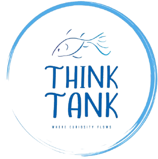

<p align="center">
  
</p>

<h1 align="center">Think Tank</h1>

<p align="center"><em>Modern aquarium planner & tank manager (Expo + React Native + TypeScript)</em></p>

<p align="center">
  
  
  
  
</p>

---

# Modern Aquarium Builder & Tracker  
*(Expo + React Native + Firebase)*

Think Tank is an aquarium builder and manager designed to make planning and maintaining tanks more intuitive. 
It lets users design freshwater or saltwater aquariums through a simple, visual workflow where fish and plants can be added, named, and adjusted in real time. 
The app focuses on a clean and responsive layout that helps users visualise how their tank develops over time, all without putting real fish at risk while learning.

---

## Table of Contents
1. [Description](#description)
2. [Why I Built This](#why-i-built-this)
3. [Technologies & Tools](#technologies--tools)
4. [Core Features](#core-features)
5. [Installation](#installation)
6. [Run Development Servers](#run-development-servers)
7. [Screenshots](#screenshots)
8. [Data Model](#data-model)
9. [Project Structure](#project-structure)
10. [Development Process](#development-process)
11. [Final Outcome](#final-outcome)
12. [Conclusion](#conclusion)
13. [Authors & Acknowledgements](#authors--acknowledgements)
14. [Roadmap](#roadmap)
15. [Contributing](#contributing)
16. [Performance & DX](#performance--dx)
17. [Tools & Libraries](#tools--libraries)
18. [Licence](#licence)
29. [Resources & Credits](#resources--credits)

---

## Description
Think Tank is a cross-platform app built with Expo, React Native, and Firebase. 
It allows users to plan and manage their aquariums visually. 
The Aquarium screen supports both portrait and landscape layouts for flexible editing. 
Snapshots taken within the app are displayed on the Home screen to show visual progress as a reference for how the tank design is evolving. 
The List screen allows users to explore all fish, plants, and décor available, with search and filtering options, and each element links to a dedicated Details screen where the user can learn more about it. 

---

## Why I Built This
I’ve always enjoyed keeping fish, but it can be discouraging when mistakes happen, especially when they lead to harm. 
Think Tank was built to help new and experienced fishkeepers plan responsibly and learn through experimentation without risking the wellbeing of real animals. 
It’s meant to make aquarium keeping approachable and creative while encouraging thoughtful decisions and better care practices. 
By combining a hands-on interface with learning-driven features, Think Tank helps users understand compatibility, tank balance, and environmental needs before applying them in real life.

---

## Technologies & Tools
- Expo, React Native, React, TypeScript  
- React Navigation (Native Stack)  
- Firebase Auth and Firestore  
- AsyncStorage (for persistent login)  
- React Native libraries:  
  `react-native-view-shot`, `react-native-reanimated`, `react-native-gesture-handler`, `@react-native-community/slider`  
- Developer utilities for linting, configuration, and testing

---

## Core Features
- Drag-and-drop aquarium builder for fish, plants, and décor  
- Freshwater and saltwater modes  
- Option to name fish and personalise each setup  
- Tank snapshot displayed on the Home screen to show progress visually  
- Dedicated Details screen for each element (fish, plant, décor) with educational information
- List screen for browsing, searching, and filtering available elements  
- Email/password authentication with persistent login  
- Tank Overview card showing tank volume, stock list, and quick actions  
- Fully responsive layout supporting portrait and landscape orientations  

---

## Installation

```bash
# 1) Install dependencies
npm install
# or
yarn install

# 2) Configure Firebase in firebase.js
#    (Project Settings → General → SDK setup & config)
```

<br>

```js
// firebase.js (snippet)
import AsyncStorage from '@react-native-async-storage/async-storage';
import { getApp, getApps, initializeApp } from 'firebase/app';
import { getAuth, getReactNativePersistence, initializeAuth } from 'firebase/auth';
import { getFirestore } from 'firebase/firestore';

const firebaseConfig = { /* your keys here */ };

const app = getApps().length ? getApp() : initializeApp(firebaseConfig);

let auth;
try {
  auth = getAuth(app);
} catch {
  auth = initializeAuth(app, { persistence: getReactNativePersistence(AsyncStorage) });
}

export const db = getFirestore(app);
export { auth };
```

---

## Run Development Servers

```bash
npm start         # Expo dev server (scan QR with Expo Go)
npm run android   # Prebuild & run on Android
npm run ios       # Prebuild & run on iOS (macOS required)
npm run web       # Run on web
npm run lint      # Lint project
```

---

## Screenshots

<p align="center">
  
  
  
  
</p>

<div align="center" style="display: inline-flex; gap: 10px;">
  
  
</div>

---

## Data Model
The app stores one active tank per user at a time:  
```
users/{{uid}}/tanks/current
```
Type (from `services/tanks.ts`):
```ts
export type TankConfig = {
  name?: string;
  sizeLiters?: number;
  fish?: any[];
  plants?: any[];
  settings?: Record<string, any>;
  previewUri?: string;
  updatedAt?: any;
}
```

---

## Project Structure
```
- App.tsx
- app/
  - (tabs)/
  - +not-found.tsx
  - _layout.tsx
- assets/
  - fonts/
  - images/
- components/
  - Collapsible.tsx
  - TankOverviewCard.tsx
  - ThemedText.tsx
  - ThemedView.tsx
- constants/
  - Colors.ts
- firebase.js
- screens/
  - AquariumScreen.tsx
  - DetailsScreen.tsx
  - HomeScreen.tsx
  - ListScreen.tsx
  - LoginScreen.tsx
  - SignupScreen.tsx
- services/
  - tanks.ts
  - signOut.tsx
- tsconfig.json
```

Key files include `App.tsx` for route setup, the `screens/` folder for main navigation, and the `services/` folder for Firebase interactions.

---

## Development Process

Think Tank was developed with a strong focus on experimentation, visual clarity, and interaction design. The project needed to feel playful and intuitive while still teaching users about compatibility, tank balance, and responsible aquarium planning. Below is an overview of the technical and creative decisions that guided the development process.

### System Architecture

Think Tank uses a modular Expo architecture:

- **Frontend:** Expo + React Native + TypeScript  
- **Backend:** Firebase Authentication + Firestore  
- **Local Storage:** AsyncStorage for persistent login and tank snapshots  
- **Interaction:** React Native Gesture Handler + Reanimated  
- **Layout:** Responsive portrait/landscape support using hooks and media-aware UI components  

Key reasons for choosing this stack:
- Expo removes native complexity and speeds up iteration  
- Firebase provides real-time, scalable storage  
- React Native supports dynamic UI layouts essential for the drag-and-drop aquarium builder  

### Key Technical Decisions

- **Drag-and-drop builder:** Implemented using `react-native-gesture-handler` + `react-native-reanimated` to ensure smooth, frame-stable dragging.
- **Snapshots:** Implemented using `react-native-view-shot` to capture the aquarium canvas and display progress on the Home screen.
- **Responsive aquarium canvas:** The layout dynamically recalculates its grid when orientation changes to prevent fish/decor from jumping positions.
- **Centralised data model:** All tank data is saved under a single Firestore document (`users/{uid}/tanks/current`) to reduce reads and simplify updates.
- **Landscape mode editing:** Landscape mode unlocks more precise drag space, so UI elements reposition automatically to avoid overlapping.

### Challenges & Solutions

**1. Layout stability between orientations**  
Solution: Recalculate tank canvas dimensions on focus + orientation listeners, then reposition elements safely.

**2. Snapshots capturing blank screens**  
Solution: Delayed snapshot capture using `setTimeout` + view readiness checks.

**3. Gesture performance on older devices**  
Solution: Reduced re-renders with `useMemo` and moved heavy logic out of render cycles.

**4. Large data images slowing the List screen**  
Solution: Added lazy loading and cached React Native images.

Overall, the development process focused on stability, education, and smooth interaction.

---

## Final Outcome

Think Tank successfully delivers a visual, educational aquarium-planning experience that is both intuitive and accessible for beginners. Users can design tanks, preview layouts, and learn about compatibility and care before applying their ideas in real life.

## Demo
A short demo video is available here:  
👉 [Demo](/assets/demo/Demo.mp4)

---

## Conclusion

Think Tank represents a blend of creativity, interaction design, and responsible aquarium keeping. The project pushed me to refine my technical skills while also considering real-world usability and education. 

Throughout development, I focused on using feedback constructively—improving drag-and-drop performance, refining tank snapshot logic, and enhancing compatibility guidance. Each iteration made the system more stable, more intuitive, and more aligned with the project’s goal: helping fishkeepers plan responsibly without harming real animals.

Future improvements such as animated fish movement and expanded species data will continue to build on the foundations created during this phase.

---

## Authors & Acknowledgements
- **Maintainer:** Michaela Kemp  
- Thanks to the open-source teams behind Expo, React Native, and Firebase for providing accessible, well-documented tools.

---

## Roadmap
- Add subtle tank animations and fish motion within bounds  
- Allow multiple tanks per user with references under `users/{{uid}}/tanks/{tankId}`  
- Expand the species and plant database to include more detailed profiles  
- Improve automatic preview refresh on save  

---

## Contributing
This is a closed academic project. For collaboration or reuse in educational contexts, please contact the author. Non-commercial contributions are welcome.

---

## Performance & DX
- Use `npx expo install` to ensure SDK compatibility  
- If native modules aren’t running correctly, prebuild once using `npm run android` or `npm run ios`  
---

## Tools & Libraries
- Expo, React Native, React, TypeScript  
- Firebase (Auth, Firestore)  
- React Navigation (Native Stack)  
- RN Libraries: `react-native-view-shot`, `react-native-reanimated`, `react-native-gesture-handler`, `@react-native-community/slider`

---

## Licence

**Educational Use Only**  
This project was created for academic purposes as part of VC300 at Open Window.  
It may be viewed, referenced, or demonstrated, but not redistributed or used commercially.

---

## Resources & Credits
- Expo Docs • React Native Docs • Firebase Docs  
- Community threads and examples from GitHub and Stack Overflow

© Michaela Kemp, 2025. All rights reserved.
