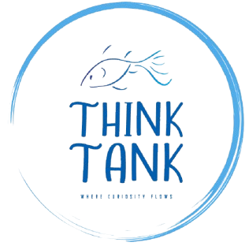

<div align="center">
  
  <h1>Think Tank</h1>
  <p><em>Modern aquarium planner & tank manager (Expo + React Native + TypeScript)</em></p>

  <p>
    
    
    
    
  </p>
</div>

---

# Modern Aquarium Builder & Tracker (Expo + React Native + Firebase)

Think Tank lets you **design** and **manage** freshwater or saltwater aquariums with a fun, visual workflow:
drag in fish and plants/macros, capture a preview, and sync your setup to the cloud. It’s built for an easy,
playful experience with clean UI and quick actions.

## Table of Contents
1. [Description](#description)
2. [Why I Built This](#why-i-built-this)
3. [Technologies & Tools](#technologies--tools)
4. [Core Features](#core-features)
5. [Installation](#installation)
6. [Run Development Servers](#run-development-servers)
7. [Screenshots](#screenshots)
8. [Data Model](#data-model)
9. [Project Structure](#project-structure)
10. [Demo](#demo)
11. [Authors & Acknowledgements](#authors--acknowledgements)
12. [Roadmap](#roadmap)
13. [Contributing](#contributing)
14. [Performance & DX](#performance--dx)
15. [Tools & Libraries](#tools--libraries)
16. [Resources and Credits](#resources-and-credits)

## Description
**Think Tank** is a cross-platform app (Android, iOS, Web via Expo) for aquarium enthusiasts. Create a tank, add fish and plants, and keep a synced snapshot of your current configuration. The **Aquarium** screen supports
landscape mode for comfortable editing; a **Tank Overview** card provides quick context and actions.

## Why I Built This
I kept fish before and felt demotivated when they died/ I didn’t always know what I’d done wrong. Think Tank is my
answer: make learning **hands-on** and **visual** so new fish keepers can avoid common mistakes and fewer fish are harmed.

## Technologies & Tools
- Expo • React Native • React • TypeScript
- React Navigation (native stack)
- Firebase Auth + Firestore
- AsyncStorage (RN auth persistence)
- React Native libs: `react-native-view-shot`, `react-native-reanimated`, `react-native-gesture-handler`, `@react-native-community/slider`
- Developer utilities: Expo config, linting, scripts

## Core Features
- 🐠 **Drag-and-drop builder** for fish, plants/macros, and décor
- 🌊 **Freshwater & saltwater** modes
- 🖼️ **Tank snapshot on Home** — capture via `react-native-view-shot`, saved locally and synced to Firestore
- 🔄 **Cloud sync** of the current tank to Firestore
- 🔐 **Email/password auth** with persistent login via AsyncStorage
- 🧭 **Tank Overview** card: preview image, volume, stock list, quick actions
- 📱 **Portrait/landscape** support (orientation handled in Aquarium screen)

## Installation
```bash
# 1) Install deps
npm install
# or
yarn install

# 2) Configure Firebase in firebase.js
#    (Project Settings → General → SDK setup & config)
```

```js
// firebase.js (snippet)
import AsyncStorage from '@react-native-async-storage/async-storage';
import { getApp, getApps, initializeApp } from 'firebase/app';
import { getAuth, getReactNativePersistence, initializeAuth } from 'firebase/auth';
import { getFirestore } from 'firebase/firestore';

const firebaseConfig = /* your keys */;

const app = getApps().length ? getApp() : initializeApp(firebaseConfig);

let auth;
try { auth = getAuth(app); }
catch { auth = initializeAuth(app, { persistence: getReactNativePersistence(AsyncStorage) }); }

export const db = getFirestore(app);
export { auth };
```

## Run Development Servers
```bash
npm start         # Expo dev server
# press 'a' to open Android emulator, or scan the QR with Expo Go

npm run android   # prebuild & run on Android
npm run ios       # prebuild & run on iOS (macOS required)
npm run web       # web preview
npm run lint      # lint
```

## Screenshots
- `assets/screenshots/Login.jpg`
- `assets/screenshots/Signup.jpg`
- `assets/screenshots/Home.jpg`
- `assets/screenshots/List.jpg`
- `assets/screenshots/Details.jpg`
- `assets/screenshots/Aquarium.jpg`

## Data Model
The app stores a single **current tank** document per user:
```
users/{{uid}}/tanks/current
```
Type (from `services/tanks.ts`):
```ts
export type TankConfig = {
  name?: string;
  sizeLiters?: number;
  fish?: any[];
  plants?: any[];
  settings?: Record<string, any>;
  previewUri?: string;
  updatedAt?: any;
}
```

## Project Structure
```
- .expo/
  - README.md
  - devices.json
  - types/
- .gitignore
- .idea/
  - .gitignore
  - caches/
  - deviceManager.xml
  - misc.xml
  - modules.xml
  - think-tank.iml
  - vcs.xml
- .vscode/
  - settings.json
- App.tsx
- README.md
- android/
  - .gitignore
  - app/
  - build.gradle
  - gradle/
  - gradle.properties
  - gradlew
  - gradlew.bat
  - settings.gradle
- app/
  - (tabs)/
  - +not-found.tsx
  - _layout.tsx
- app.json
- assets/
  - fonts/
  - images/
- components/
  - Collapsible.tsx
  - ExternalLink.tsx
  - HapticTab.tsx
  - HelloWave.tsx
  - ParallaxScrollView.tsx
  - TankOverviewCard.tsx
  - ThemedText.tsx
  - ThemedView.tsx
  - ui/
  - ui.tsx
- constants/
  - Colors.ts
- eslint.config.js
- expo-env.d.ts
- firebase.js
- hooks/
  - useAuthState.tsx
  - useColorScheme.ts
  - useColorScheme.web.ts
  - useThemeColor.ts
- index.ts
- package-lock.json
- package.json
- screens/
  - AquariumScreen.tsx
  - DetailsScreen.tsx
  - HomeScreen.tsx
  - ListScreen.tsx
  - LoginScreen.tsx
  - SignupScreen.tsx
- scripts/
  - reset-project.js
- services/
  - DbService.js
  - progress.tsx
  - signOut.tsx
  - tanks.ts
- tsconfig.json
```

### Key files
- `App.tsx` – navigation & route gating based on auth
- `screens/` – main screens:
  - AquariumScreen.tsx
  - DetailsScreen.tsx
  - HomeScreen.tsx
  - ListScreen.tsx
  - LoginScreen.tsx
  - SignupScreen.tsx
- `components/` – reusable UI:
  - Collapsible.tsx
  - ExternalLink.tsx
  - HapticTab.tsx
  - HelloWave.tsx
  - ParallaxScrollView.tsx
  - TankOverviewCard.tsx
  - ThemedText.tsx
  - ThemedView.tsx
  - ui.tsx
- `services/tanks.ts` – Firestore helpers
- `firebase.js` – Auth + Firestore bootstrap
- `assets/` – images & fonts

## Demo
The demonstration video is linked here.  
👉 **Video:** (./assets/demo/demo.mp4)

## Authors & Acknowledgements
- **Maintainer:** Michaela Kemp
- Thanks to open-source contributors behind Expo, React Native, and Firebase.

## Roadmap
- 🎏 **Tank animations** on the Aquarium screen  
  - Splash/ripple animation when adding a fish
  - Fish swim paths & idle motion within bounds; gentle easing & “bounce” on edges
- 🗂️ **Multiple tanks** per user
  Path: `users/{{uid}}/tanks/{tankId}` with a `current` pointer
- 🖼️ **Smarter Home snapshot**  
  - Auto-refresh preview after save

## Contributing
This is a closed academic project. If you’d like to reuse any part of Think Tank or collaborate on improvements, please contact the author listed above. Contributions are welcome for non-commercial academic use.

## Performance & DX
- Prefer `npx expo install` for dependency alignment with your Expo SDK.
- If native modules act up, run a one-time `npm run android`/`npm run ios` to prebuild.
- On physical devices, accept media permissions before capturing screenshots.


## Tools & Libraries
- Expo, React Native, React, TypeScript
- Firebase (Auth, Firestore)
- React Navigation (native stack)
- RN libs: `react-native-view-shot`, `react-native-reanimated`, `react-native-gesture-handler`, `@react-native-community/slider`

## Resources and Credits
- Expo docs • React Native docs • Firebase docs
- Community threads and examples across Stack Overflow & GitHub
